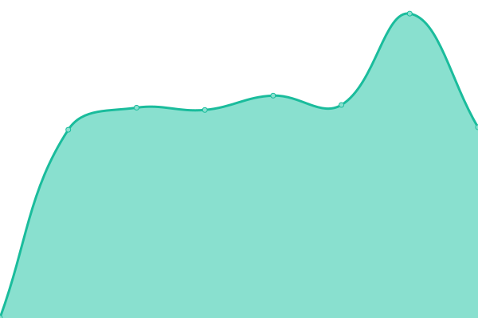

# [📈 Live Status](https://uptime.hisao.org): <!--live status--> **🟩 All systems operational**

This repository contains the open-source uptime monitor and status page for [Hisao](jaimehisao.github.io).

<!--start: status pages-->
<!-- This summary is generated by Upptime (https://github.com/upptime/upptime) -->
<!-- Do not edit this manually, your changes will be overwritten -->
<!-- prettier-ignore -->
| URL | Status | History | Response Time | Uptime |
| --- | ------ | ------- | ------------- | ------ |
|  Zeus API | 🟩 Up | [zeus-api.yml](https://github.com/jaimehisao/status/commits/master/history/zeus-api.yml) | 

 779ms
     
 | 

<a href="https://status.hisao.org/history/zeus-api">100.00%</a>
    

<!--end: status pages-->

[**Visit our status website →**](https://status.hisao.org)

## 📄 License

- Code: [MIT](./LICENSE) © [Hisao](jaimehisao.github.io)
